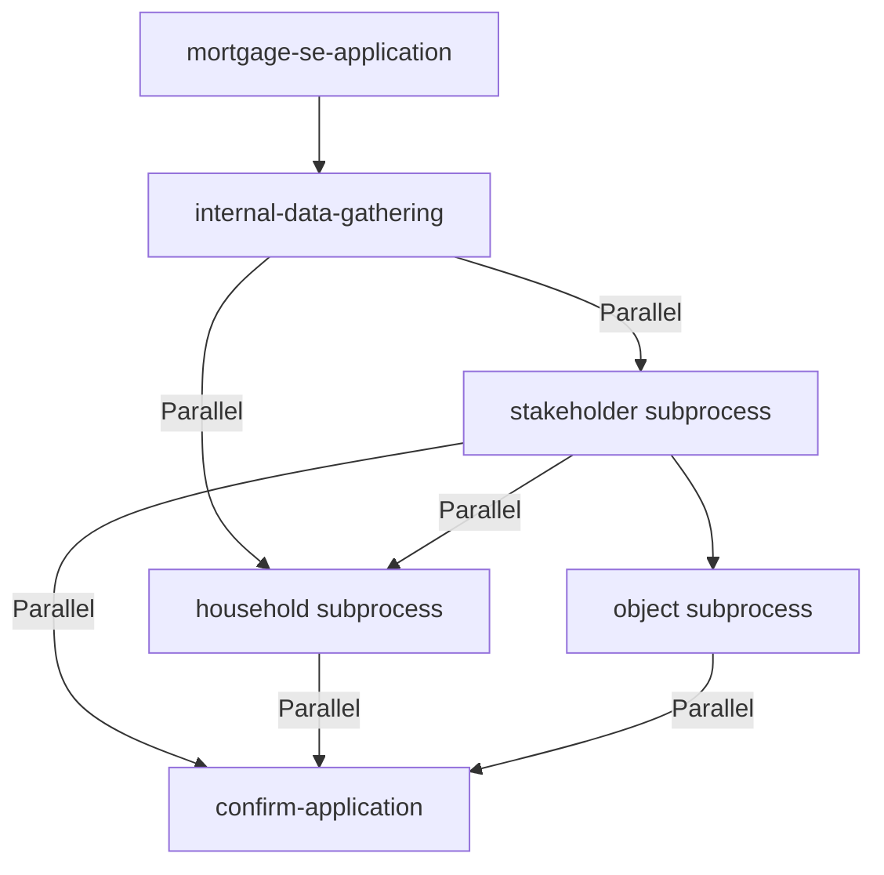

# Analys: Förbättringsmöjligheter för Application Epics

**Datum:** 2024-12-19  
**Analys av:** Epics under mortgage-se-application processen

---

## Översikt

Application-processen innehåller **19 epics** som är fördelade över:
- **internal-data-gathering** subprocess (3 epics)
- **stakeholder** subprocess (6 epics)
- **household** subprocess (1 epic)
- **object** subprocess (3 epics direkt + 5 epics i object-information subprocess)
- **confirm-application** (1 epic direkt i application)

**Status:** Alla epics har HTML-dokumentation med Mermaid-stöd och relevanta diagram.

---

## Identifierade förbättringsmöjligheter

### 1. Processkontext & Översikt (Prioritet: Hög)

#### Problem:
- Epics saknar tydlig kontext om var de befinner sig i Application-processen
- Ingen översikt över hur epics hänger ihop i Application-flödet
- Svårt att förstå beroenden mellan epics på övergripande nivå

#### Förbättring:
**Lägg till sektion "Processkontext"** efter "Syfte & Värde":
- Visuellt diagram som visar epicens position i Application-processen
- Tydliggör vilken subprocess epicen tillhör
- Visar föregående och efterföljande steg
- Använder Mermaid flowchart för att visa processhierarki

**Exempel:**


---

### 2. API Dokumentation - Konsekvens & Detaljer (Prioritet: Medium)

#### Problem:
- Vissa epics har "API Dokumentation" sektion, andra saknar den helt
- API-dokumentationen är ofta minimal (bara en endpoint)
- Saknar detaljer om request/response, autentisering, felkoder

#### Förbättring:
**Standardisera API Dokumentation sektion:**
- Lägg till för alla serviceTask och businessRuleTask epics
- Inkludera:
  - Request/Response scheman (exempel)
  - Autentisering (API keys, tokens)
  - Felkoder och felhantering
  - Rate limiting (om relevant)
  - Externa API:er som används (SPAR, UC, etc.)

**Struktur:**
```markdown
### API-endpoints (exponerade)
- POST /api/fetch-personal-information
  - Request: { personnummer, applicationId }
  - Response: { personalInformation, status, metadata }
  - Felkoder: 400 (Bad Request), 404 (Not Found), 500 (Server Error)

### Externa API:er (används)
- SPAR/Skatteverket REST API
  - Endpoint: /api/person/{personnummer}
  - Autentisering: API key
  - Rate limit: 100 requests/minut
```

---

### 3. BPMN – Process (Bild) - Förbättring (Prioritet: Low)

#### Problem:
- Sektionen finns i alla epics men är ofta bara en placeholder
- Länken "#/bpmn/mortgage-se-stakeholder.bpmn" fungerar inte
- Ingen visuell representation av epicens position i BPMN

#### Förbättring:
**Alternativ 1: Ta bort sektionen** (om den inte används)
- Om BPMN-viewer inte är implementerad, ta bort sektionen

**Alternativ 2: Förbättra sektionen** (om BPMN-viewer finns)
- Lägg till faktisk länk till BPMN-viewer
- Lägg till Mermaid-diagram som visar epicens position i processen
- Visa relevanta gateways och events runt epicen

---

### 4. Beroenden & Relaterade Noder - Förbättring (Prioritet: Medium)

#### Problem:
- "Relaterade noder" sektionen finns men kan vara mer strukturerad
- Beroenden mellan epics är textbaserade, svårt att se flödet

#### Förbättring:
**Lägg till visuellt beroendediagram:**
- Mermaid flowchart som visar:
  - Föregående epics (inputs)
  - Efterföljande epics (outputs)
  - Parallella epics (om relevant)
  - Gateway-beslut som påverkar flödet

**Strukturera beroenden:**
- Separera i "Föregående steg" (prerequisites), "Efterföljande steg" (outputs), "Parallella steg" (parallel execution)

---

### 5. Felhantering & Edge Cases - Strukturering (Prioritet: Medium)

#### Problem:
- Felhantering finns i "Funktionellt flöde" men kan vara svår att hitta
- Edge cases är ofta bara en lista utan struktur

#### Förbättring:
**Lägg till dedikerad sektion "Felhantering & Edge Cases":**
- Separera från "Funktionellt flöde"
- Strukturera enligt:
  - Tekniska fel (timeout, API-fel, databasfel)
  - Affärsrelaterade fel (validering, policy, regler)
  - Edge cases (unika scenarion, gränsvärden)
  - Retry-strategier (om relevant)

---

### 6. Prestanda & SLA - Saknas (Prioritet: Low)

#### Problem:
- Ingen information om förväntad prestanda eller SLA
- Ingen information om timeout-värden eller retry-strategier

#### Förbättring:
**Lägg till sektion "Prestanda & SLA"** (för serviceTask epics):
- Förväntad körtid
- Timeout-värden
- Retry-strategier (exponentiell backoff, max retries)
- Rate limiting (om relevant)

---

### 7. Data Flow - Förbättring (Prioritet: Low)

#### Problem:
- Data Flow Diagram finns bara för vissa epics (valuate-property, register-household-economy-information)
- Andra epics som hanterar data saknar detta

#### Förbättring:
**Lägg till Data Flow Diagram för fler epics:**
- Epics som aggregerar data (register-household-economy-information) ✅
- Epics som transformerar data (evaluate-personal-information, assess-stakeholder)
- Epics som hämtar och kombinerar data från flera källor

---

### 8. Sektionsordning - Standardisering (Prioritet: Low)

#### Problem:
- Sektionerna varierar i ordning mellan epics
- Vissa epics har "API Dokumentation", andra inte

#### Förbättring:
**Standardisera sektionsordning:**
1. Epic-metadata (namn, BPMN-fil, element ID, etc.)
2. Syfte & Värde
3. **Processkontext** (NY)
4. Användarupplevelse
5. Funktionellt flöde
6. Inputs & Datakällor
7. Outputs
8. Arkitektur & Systeminteraktioner
9. **API Dokumentation** (för serviceTask/businessRuleTask)
10. Affärsregler & Beroenden
11. **Felhantering & Edge Cases** (NY eller flyttad)
12. Test Information
13. Implementation Notes
14. Relaterade noder
15. BPMN – Process (Bild) (eller ta bort)

---

## Prioritering

### Hög prioritet (Gör först):
1. ✅ **Processkontext & Översikt** - Lägg till sektion som visar epicens position i Application-processen
2. ✅ **API Dokumentation - Konsekvens** - Standardisera och förbättra API-dokumentation för alla relevanta epics

### Medium prioritet (Gör sedan):
3. ✅ **Beroenden & Relaterade Noder** - Lägg till visuellt beroendediagram
4. ✅ **Felhantering & Edge Cases** - Strukturera bättre, eventuellt egen sektion

### Low prioritet (Gör sist eller hoppa över):
5. ⚠️ **BPMN – Process (Bild)** - Ta bort om inte används, eller förbättra om BPMN-viewer finns
6. ⚠️ **Prestanda & SLA** - Lägg till om relevant (främst för serviceTask)
7. ⚠️ **Data Flow** - Lägg till för fler epics om det ger värde
8. ⚠️ **Sektionsordning** - Standardisera om det ger värde

---

## Rekommendation

**Starta med:**
1. Lägg till "Processkontext" sektion för alla Application-epics
2. Standardisera och förbättra "API Dokumentation" för serviceTask/businessRuleTask epics
3. Förbättra "Relaterade noder" med visuellt beroendediagram

**Dessa förbättringar ger:**
- Bättre kontext och förståelse för var epicen ligger i processen
- Tydligare API-dokumentation för utvecklare
- Bättre översikt över beroenden mellan epics

**Skippa (för nu):**
- Prestanda & SLA (kan läggas till senare om det behövs)
- BPMN – Process (Bild) (ta bort om inte används)
- Sektionsordning (nuvarande ordning fungerar)

---

## Nästa steg

1. **Analysera** - ✅ Klar (denna fil)
2. **Diskutera** - Visa analysen för användaren
3. **Implementera** - Börja med högsta prioritet om godkänt

