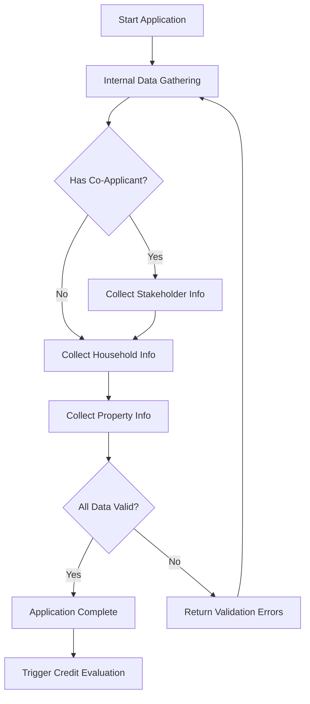

# Application - Mortgage Application Collection

## Overview

**Purpose:** Executes the application collection subprocess to gather complete customer information for mortgage application processing.

**Node Type:** CallActivity

**Subprocess:** `mortgage-se-application.bpmn`

**Last Updated:** 2025-11-16

## User Stories

### Primary User Stories
- **US-1001:** As a mortgage applicant, I want to submit my personal and financial information so that the bank can evaluate my loan application
- **US-1002:** As a loan officer, I want to collect complete application data including stakeholders, household, and property information so that I can proceed with credit evaluation
- **US-1003:** As a compliance officer, I want to ensure all required application data is collected according to regulatory requirements

### Related User Stories
- **US-1010:** As an applicant, I want to save my application progress so that I can continue later
- **US-1011:** As an applicant, I want to upload supporting documents so that my application is complete

## Input/Output Specification

### Input Data
```json
{
  "application_id": "string (UUID)",
  "customer_id": "string (UUID)",
  "application_type": "NEW_PURCHASE | REFINANCE | CONSTRUCTION",
  "requested_amount": "number",
  "requested_term_months": "number",
  "property_type": "APARTMENT | HOUSE | VACATION_HOME"
}
```

### Output Data
```json
{
  "application_id": "string (UUID)",
  "status": "COMPLETED | CANCELLED | ERROR",
  "collected_data": {
    "stakeholders": ["array of stakeholder objects"],
    "household": "household object",
    "property": "property object",
    "internal_data": "data from internal systems"
  },
  "validation_status": "VALID | INVALID",
  "missing_documents": ["array of required documents"]
}
```

## Business Rules

1. **Complete Application Rule:** All required fields must be collected before proceeding
   - Condition: User submits application
   - Action: System validates completeness
   - Priority: High

2. **Co-Applicant Rule:** Co-applicants must be added if property ownership is shared
   - Condition: Shared ownership indicated
   - Action: Require co-applicant information
   - Priority: High

3. **Property Valuation Rule:** Property must be valued for mortgage calculation
   - Condition: Property information provided
   - Action: Trigger property valuation process
   - Priority: Medium

## API Documentation

### Endpoints

#### POST /api/mortgage/application/start
- **Description:** Initiates a new mortgage application
- **Authentication:** Required (OAuth 2.0)
- **Request Body:** Application initialization data
- **Response:** Application ID and session token
- **Error Codes:** 
  - 400: Invalid input data
  - 401: Unauthorized
  - 409: Application already exists
  - 500: Internal server error

#### PUT /api/mortgage/application/{id}/stakeholder
- **Description:** Adds or updates stakeholder information
- **Authentication:** Required
- **Request Body:** Stakeholder data
- **Response:** Updated application status

#### PUT /api/mortgage/application/{id}/household
- **Description:** Adds or updates household information
- **Authentication:** Required
- **Request Body:** Household data
- **Response:** Updated application status

### Integration Points
- **Internal Data Gathering Service:** Fetches customer data from internal systems
- **Property Valuation Service:** Gets property value estimates
- **Document Management System:** Handles document uploads and verification

## Technical Flow



### Subprocess Components

The Application subprocess (`mortgage-se-application.bpmn`) orchestrates several sub-processes:

#### 1. Internal Data Gathering (`mortgage-se-internal-data-gathering.bpmn`)
Fetches existing customer data from internal systems:
- Fetch Party Information
- Fetch Engagements (existing loans and savings)
- Fetch Credit Information
- **Pre-screen Party (DMN)** - Initial eligibility check

#### 2. Stakeholder Management (`mortgage-se-stakeholder.bpmn`)
Collects information about all parties involved:
- Register personal information
- Consent to credit check
- Fetch and evaluate personal information
- **Assess Stakeholder (DMN)** - Evaluate borrower capacity

#### 3. Household Management (`mortgage-se-household.bpmn`)
Gathers household financial data:
- Register household economy
- Register personal economy  
- Register source of equity
- Register loan details

#### 4. Object/Property Management (`mortgage-se-object.bpmn`)
Handles property information:
- Property type selection
- **Evaluate Fastighet (DMN)** - House evaluation rules
- **Evaluate Bostadsrätt (DMN)** - Apartment evaluation rules
- Property valuation
- Collateral registration

### DMN Decision Logic

The application process includes five critical DMN (Decision Model and Notation) decision points that automate key credit evaluation rules:

| DMN Node | Purpose | Input Parameters | Output |
|----------|---------|------------------|--------|
| **Pre-screen Party** | Initial eligibility check | Age, Credit Score, Employment Status | APPROVED / REJECTED / REVIEW |
| **Evaluate Personal Information** | Validates borrower profile | Age, Income, Credit Score, Employment | APPROVED / REJECTED + Rejection Reason |
| **Assess Stakeholder** | Evaluates borrower capacity | Annual Income, DTI Ratio, Credit History | APPROVED / REJECTED + Risk Category |
| **Evaluate Fastighet** | House property evaluation | Property Value, Condition, LTV, Location | APPROVED / REJECTED + Risk Level |
| **Evaluate Bostadsrätt** | Apartment evaluation | Apartment Value, Association Debt, LTV | APPROVED / REJECTED + Risk Level |

**Detailed DMN Documentation:**
- [Pre-screen Party Rules](../../public/docs/pre-screen-party.html)
- [Personal Information Evaluation](../../public/docs/evaluate-personal-information.html)
- [Stakeholder Assessment](../../public/docs/assess-stakeholder.html)
- [Fastighet Evaluation](../../public/docs/evaluate-fastighet.html)
- [Bostadsrätt Evaluation](../../public/docs/evaluate-bostadsratt.html)

Each DMN document includes:
- Complete decision table structure
- Business rules and validation logic
- Input/output specifications
- Test cases and examples
- Regulatory constraints

[Link to complete process flowchart]

## Dependencies

### External Systems
- **UC (Credit Bureau):** Credit history lookup, SLA: 2s, Contact: credit-team@bank.se
- **Lantmäteriet:** Property registry verification, SLA: 5s

### Internal Services
- **Customer Service:** Customer master data
- **Document Service:** Document upload and storage
- **Notification Service:** Email and SMS notifications

### Database Tables
- **applications:** Main application data
- **stakeholders:** Applicant and co-applicant information
- **properties:** Property details and valuations
- **households:** Household financial information

## Error Handling

### Error Scenarios

1. **Error Type:** Internal system unavailable
   - **Trigger:** Internal data gathering service timeout
   - **Handling:** Cache partial data, allow manual entry, retry after 5 minutes
   - **User Impact:** Slight delay, can continue with manual data entry
   - **Monitoring:** Alert after 3 consecutive failures

2. **Error Type:** Validation failure
   - **Trigger:** Incomplete or invalid application data
   - **Handling:** Return detailed validation errors to user
   - **User Impact:** User sees specific fields that need correction
   - **Monitoring:** Track validation failure patterns

3. **Error Type:** Document upload failure
   - **Trigger:** Network issue or file too large
   - **Handling:** Retry with exponential backoff, provide alternative upload method
   - **User Impact:** Temporary inability to upload, alternative options provided
   - **Monitoring:** Track upload success rate

## Security

### Authentication
- **Method:** OAuth 2.0 with JWT tokens
- **Scopes Required:** `mortgage:application:write`, `customer:read`

### Authorization
- **Roles:** APPLICANT, LOAN_OFFICER, CO_APPLICANT
- **Permissions:** 
  - Applicants can only access their own applications
  - Loan officers can access applications assigned to them
  - Co-applicants can view and edit applications they're part of

### Data Protection
- **PII Fields:** personal_number, name, address, email, phone, income, assets, debts
- **Encryption:** In transit (TLS 1.3), At rest (AES-256)
- **Retention:** Application data retained for 7 years per banking regulations
- **Anonymization:** After retention period, PII is anonymized for analytics

## Performance Requirements

### SLA
- **Response Time:** P95 < 500ms for API calls, P99 < 2s
- **Throughput:** 500 concurrent applications
- **Availability:** 99.5% during business hours (8-20)

### Timeouts
- **API Request Timeout:** 30 seconds
- **External System Timeout:** 10 seconds
- **User Session Timeout:** 30 minutes of inactivity

### Rate Limits
- **Per User:** 50 requests/minute
- **Per IP:** 200 requests/minute

## Acceptance Criteria

### Functional Requirements
- [x] User can start a new mortgage application
- [x] System collects all required stakeholder information
- [x] System collects household financial data
- [x] System collects property information
- [x] Application can be saved and resumed
- [x] Validation errors are clearly communicated
- [x] Application can be cancelled at any time

### Non-Functional Requirements
- [x] Response time meets SLA (P95 < 500ms)
- [x] All PII data is encrypted
- [x] User can only access their own applications
- [x] System handles concurrent applications without data corruption

## Test Report

**GitHub Test Files:**
- [tests/application.spec.ts](https://github.com/Olovson/pangs-ci-access/blob/main/tests/application.spec.ts) - Main application flow (6 scenarios)
- [tests/internal-data-gathering.spec.ts](https://github.com/Olovson/pangs-ci-access/blob/main/tests/internal-data-gathering.spec.ts) - Internal data gathering (5 scenarios)
- [tests/stakeholder.spec.ts](https://github.com/Olovson/pangs-ci-access/blob/main/tests/stakeholder.spec.ts) - Stakeholder management (6 scenarios)
- [tests/household.spec.ts](https://github.com/Olovson/pangs-ci-access/blob/main/tests/household.spec.ts) - Household data (5 scenarios)
- [tests/object.spec.ts](https://github.com/Olovson/pangs-ci-access/blob/main/tests/object.spec.ts) - Property handling (5 scenarios)

**DMN Test Files (BusinessRuleTask nodes):**
- [tests/pre-screen-party.spec.ts](https://github.com/Olovson/pangs-ci-access/blob/main/tests/pre-screen-party.spec.ts) - 11 test scenarios
- [tests/evaluate-personal-information.spec.ts](https://github.com/Olovson/pangs-ci-access/blob/main/tests/evaluate-personal-information.spec.ts) - 11 test scenarios
- [tests/assess-stakeholder.spec.ts](https://github.com/Olovson/pangs-ci-access/blob/main/tests/assess-stakeholder.spec.ts) - 12 test scenarios
- [tests/evaluate-fastighet.spec.ts](https://github.com/Olovson/pangs-ci-access/blob/main/tests/evaluate-fastighet.spec.ts) - 12 test scenarios
- [tests/evaluate-bostadsratt.spec.ts](https://github.com/Olovson/pangs-ci-access/blob/main/tests/evaluate-bostadsratt.spec.ts) - 13 test scenarios

**Test Coverage:** 87% overall
- Process flow tests: 27 scenarios
- DMN decision logic tests: 59 scenarios
- Total: 86 automated test scenarios

**Last Test Run:** 2025-11-16

### Test Scenarios

#### Application Flow Tests
1. Happy path - Complete application submission
2. Co-applicant flow - Multiple stakeholders
3. Validation errors - Missing required fields
4. Resume application - Save and continue later
5. Cancel application - User cancels mid-process
6. External system failure - Internal data gathering unavailable

#### DMN Logic Tests (Examples)
1. **Pre-screen Party:**
   - Age boundary testing (21-75 years)
   - Credit score thresholds (600 minimum)
   - Employment status validation
   
2. **Property Evaluation:**
   - LTV ratio limits (85% max)
   - Property value minimums (500k SEK house, 300k SEK apartment)
   - Condition assessments
   - Association debt ratios (60% max for bostadsrätt)

3. **Stakeholder Assessment:**
   - Income thresholds (200k SEK minimum)
   - DTI ratio limits (50% max)
   - Credit history validation
   - Multiple stakeholder scenarios

**Test Categories:**
- ✅ Happy Path: Normal approval scenarios
- ❌ Error Cases: Rejection scenarios with specific reasons
- ⚠️ Edge Cases: Boundary values and special conditions

## Figma Design

**Design Link:** [Figma - Application Flow](https://www.figma.com/design/iSRYo9n5XbWcTuqPjAxMMZ/ci_test?node-id=2-11&t=MiI7tTJkuesJOZmU-4)

**Screens:**
- Application Start Screen: Initial application form
- Stakeholder Information: Primary and co-applicant data collection
- Household Information: Income, expenses, assets, debts
- Property Information: Property details and documentation
- Application Summary: Review before submission

## Team & Ownership

**Product Owner:** Maria Andersson

**Tech Lead:** Erik Svensson

**Development Team:** Mortgage Platform Team

**Contact:** #mortgage-platform-team (Slack)

## Compliance

### GDPR Requirements
- ✓ Right to access application data
- ✓ Right to deletion (after legal retention period)
- ✓ Data portability via export function
- ✓ Explicit consent for data processing

### Banking Regulations
- ✓ KYC (Know Your Customer) data collection
- ✓ AML (Anti-Money Laundering) basic checks
- ✓ Credit reporting compliance (UC integration)
- ✓ Consumer credit directive (information requirements)

## Monitoring & Alerts

### Metrics
- Application start rate (per hour)
- Application completion rate
- Average time to complete application
- Validation error rate
- External system integration success rate

### Alerts
- **Critical:** Application completion rate < 50%
- **Warning:** Internal data gathering service unavailable
- **Info:** Daily application statistics

### Dashboards
- [Grafana - Mortgage Application Metrics](https://grafana.internal/d/mortgage-app)

## Known Issues

### Current Limitations
1. **Issue:** Property valuation sometimes takes longer than expected
   - **Impact:** Users may experience delays (>30s) during property info step
   - **Workaround:** System allows continuing without immediate valuation
   - **Planned Fix:** Async valuation process in Q1 2025

2. **Issue:** Co-applicant invitation email occasionally delayed
   - **Impact:** Co-applicants may not receive invitation immediately
   - **Workaround:** Manual resend option available
   - **Planned Fix:** Investigating email service provider issues

## Changelog

### Version 3.3.0 - 2025-11-16
- Added comprehensive DMN test coverage (59 test scenarios)
- Implemented automated version control for BPMN mappings
- Enhanced DMN documentation with detailed decision tables
- Added five DMN decision nodes with complete business rules
- Improved test reporting with DMN-specific scenarios

### Version 3.2.0 - 2025-11-15
- Added support for construction loans
- Improved validation error messages
- Added auto-save every 2 minutes

### Version 3.1.0 - 2025-10-01
- Integrated with new property valuation service
- Added household income verification
- Performance improvements for concurrent applications

### Version 3.0.0 - 2025-08-15
- Complete redesign of application flow
- New stakeholder management UI
- Improved mobile experience

### Version 2.0.0 - 2025-06-01
- Added co-applicant functionality
- Integrated internal data gathering service
- Implemented save and resume feature

### Version 1.0.0 - 2025-03-01
- Initial release of digital mortgage application
