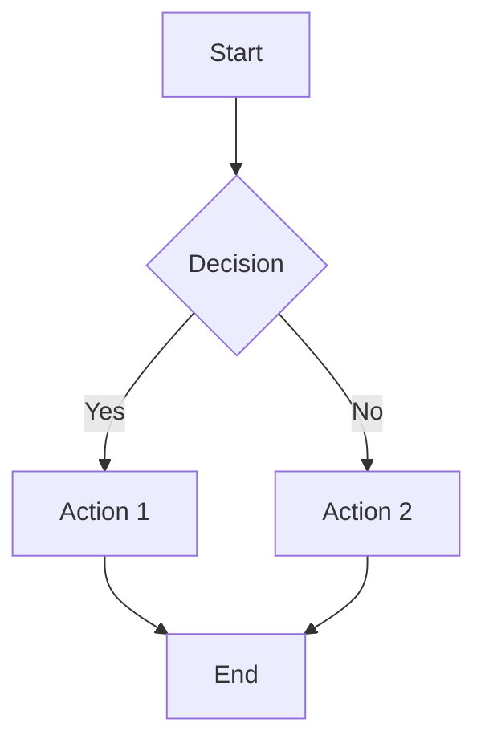

# [Node Name] - [BPMN Element ID]

## Overview

**Purpose:** [Brief description of what this node does]

**Node Type:** [CallActivity/ServiceTask/UserTask/BusinessRuleTask]

**Subprocess:** [Link to subprocess BPMN file if applicable]

**Last Updated:** [Date]

## User Stories

### Primary User Stories
- **US-XXX:** As a [role], I want to [action] so that [benefit]
- **US-XXX:** As a [role], I want to [action] so that [benefit]

### Related User Stories
- **US-XXX:** [Brief description]

## Input/Output Specification

### Input Data
```json
{
  "field1": "string",
  "field2": "number",
  "field3": {
    "nested": "object"
  }
}
```

### Output Data
```json
{
  "result": "string",
  "status": "string",
  "data": {}
}
```

## Business Rules

1. **Rule Name:** Description of the rule
   - Condition: When X happens
   - Action: System does Y
   - Priority: High/Medium/Low

2. **Validation Rules:**
   - Field X must be valid
   - Field Y must meet criteria Z

## DMN Decision Logic
_Note: This section is only applicable for BusinessRuleTask nodes. Remove if not applicable._

**Decision Model:** [Link to DMN documentation in public/docs/]

### Decision Table Overview

| Input Parameter | Type | Range/Values | Description |
|----------------|------|--------------|-------------|
| input1 | string | A/B/C | [Description] |
| input2 | number | 0-100 | [Description] |

| Output Parameter | Type | Values | Description |
|-----------------|------|--------|-------------|
| decision | string | APPROVED/REJECTED/REVIEW | Final decision |
| reason | string | text | Rejection/approval reason |

### Business Rules Summary

1. **Rule 1:** If input1 = A AND input2 > 50 THEN decision = APPROVED
2. **Rule 2:** If input1 = B OR input2 < 20 THEN decision = REJECTED
3. **Rule 3:** Edge cases require manual REVIEW

**Key Thresholds:**
- Minimum threshold: [value]
- Maximum threshold: [value]  
- Edge case boundaries: [values]

**Detailed Documentation:** See [DMN document](../../public/docs/node-name.html) for complete decision table, test cases, and validation constraints.

---

## API Documentation

### Endpoints

#### POST /api/endpoint
- **Description:** [What this endpoint does]
- **Authentication:** Required/Not Required
- **Request Body:** [Schema]
- **Response:** [Schema]
- **Error Codes:** 400, 401, 500

### Integration Points
- **System A:** Purpose of integration
- **System B:** Purpose of integration

## Technical Flow



[Link to detailed technical flowchart]

## Dependencies

### External Systems
- **System Name:** Purpose, SLA, contact
- **API Name:** Version, documentation link

### Internal Services
- **Service Name:** Purpose, owner team

### Database Tables
- **table_name:** Purpose, schema reference

## Error Handling

### Error Scenarios

1. **Error Type:** System unavailable
   - **Trigger:** External system timeout
   - **Handling:** Retry 3 times with exponential backoff
   - **User Impact:** [Description]
   - **Monitoring:** Alert threshold

2. **Error Type:** Validation failure
   - **Trigger:** Invalid input data
   - **Handling:** Return 400 with detailed error message
   - **User Impact:** User sees validation error

## Security

### Authentication
- **Method:** OAuth 2.0 / JWT / Basic Auth
- **Scopes Required:** [List of scopes]

### Authorization
- **Roles:** [List of roles that can access]
- **Permissions:** [Specific permissions required]

### Data Protection
- **PII Fields:** [List of personal data fields]
- **Encryption:** In transit (TLS 1.3), At rest (AES-256)
- **Retention:** [Data retention period]

## Performance Requirements

### SLA
- **Response Time:** P95 < 200ms, P99 < 500ms
- **Throughput:** 1000 requests/second
- **Availability:** 99.9%

### Timeouts
- **Request Timeout:** 30 seconds
- **External API Timeout:** 10 seconds

### Rate Limits
- **Per User:** 100 requests/minute
- **Per IP:** 1000 requests/minute

## Acceptance Criteria

### Functional Requirements
- [ ] User can successfully complete [action]
- [ ] System validates [data] correctly
- [ ] Integration with [system] works as expected

### Non-Functional Requirements
- [ ] Response time meets SLA
- [ ] Error handling works for all scenarios
- [ ] Security requirements are met

## Test Report

**GitHub Test File:** [Link to test file]

**Test Coverage:** XX%

**Last Test Run:** [Date]

### Test Scenarios
1. Happy path - Success case
2. Validation errors
3. System unavailability
4. Edge cases

### DMN Test Scenarios
_Note: Only applicable for BusinessRuleTask nodes with DMN logic_

**DMN Test File:** [Link to DMN-specific test file]

**DMN Test Coverage:** [Number] scenarios covering:
- ✅ Happy Path: Normal approval scenarios
- ❌ Error Cases: Rejection scenarios with reasons
- ⚠️ Edge Cases: Boundary values and special conditions

**Example DMN Tests:**
1. Minimum threshold acceptance
2. Maximum threshold rejection
3. Boundary value testing
4. Multiple input combinations
5. Rejection reason validation

## Figma Design

**Design Link:** [Figma URL]

**Screens:**
- Screen 1: [Description]
- Screen 2: [Description]

## Team & Ownership

**Product Owner:** [Name]

**Tech Lead:** [Name]

**Development Team:** [Team name]

**Contact:** [Email/Slack channel]

## Compliance

### GDPR Requirements
- Right to access
- Right to deletion
- Data portability
- Consent management

### Banking Regulations
- KYC requirements
- AML checks
- Credit reporting compliance

## Monitoring & Alerts

### Metrics
- Request rate
- Error rate
- Response time (P95, P99)
- Success rate

### Alerts
- **Critical:** Error rate > 5%
- **Warning:** Response time P99 > 1s
- **Info:** Daily summary

### Dashboards
- [Link to monitoring dashboard]

## Known Issues

### Current Limitations
1. **Issue:** [Description]
   - **Impact:** [Who is affected]
   - **Workaround:** [Temporary solution]
   - **Planned Fix:** [Timeline]

## Changelog

### Version 2.1.0 - 2025-01-15
- Added new validation rule for field X
- Improved error handling for edge case Y

### Version 2.0.0 - 2024-12-01
- Major refactoring of business logic
- Updated API contracts

### Version 1.0.0 - 2024-10-01
- Initial release
